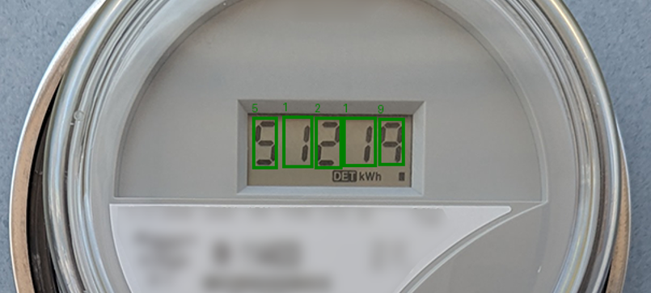

# Computer Vision Pipeline for Utility Meter Reading

## Overview

This project is an end-to-end computer vision pipeline for detecting utility meters in images and reading their displayed values.

Given a single input image, the pipeline:
- Locates the meter and relevant display regions
- Detects individual digits or indicators within the display
- Interprets the detected elements to produce a final reading

The system is built as a modular pipeline, where detection and interpretation are handled by separate models that can be trained and tested independently. The focus of this project is on practical model design, data preparation, and building a clear inference workflow rather than on a single monolithic model.

An example is shown below:



Download the models here: [pipeline_models_v4.7z](https://1drv.ms/u/c/ff40561dcb2cfa68/IQA9EesRbLTDR4uGmhpNwEnHAaCKtN0sr62oiNIYqjWYg6c?e=FwG7zN)


---

## Quick run order

### Dataset preparation

1. `check_categories.py`
2. `generate_meter_localization_dataset.py`
3. `generate_digit_localization_dataset.py`
4. `generate_digit_classification_dataset.py`

### Model fine-tuning (training)

5. `finetune_meter_localizer.py`
6. `finetune_digit_localizer.py`
7. `finetune_digit_classifier.py`

### Inference

8. `meter_vision_pipeline_v3.py`

## Supported Components

This setup installs everything commonly required for object detection workflows:

* PyTorch
  * CUDA-enabled on Windows (NVIDIA GPUs)
  * CPU / Apple Metal (MPS) on macOS
* torchvision
* NumPy
* OpenCV
* Matplotlib
* Pillow
* pycocotools (COCO annotations)
* Label Studio (annotation UI)
* Git (verified)

---

## Windows Installation (CUDA-enabled)

**Recommended for NVIDIA GPUs (CUDA 11.8)**
Run all commands in **Command Prompt or PowerShell**:

```bat
py -m pip install --upgrade pip setuptools wheel

py -m pip install torch torchvision --index-url https://download.pytorch.org/whl/cu118

py -m pip install ^
numpy ^
matplotlib ^
pillow ^
opencv-python ^
pycocotools ^
label-studio

git --version
```

### Notes (Windows)

* Requires an NVIDIA GPU with compatible CUDA drivers
* CUDA 11.8 is bundled with the PyTorch wheel (no separate CUDA install required)
* `pycocotools` installs precompiled wheels on modern Windows Python versions

---

## macOS Installation (CPU / Apple Silicon Metal)

**Supports both Intel and Apple Silicon (M1/M2/M3)**
Run all commands in **Terminal**:

```bash
python3 -m pip install --upgrade pip setuptools wheel

python3 -m pip install torch torchvision

python3 -m pip install \
numpy \
matplotlib \
pillow \
opencv-python \
pycocotools \
label-studio

git --version
```

### Notes (macOS)

* PyTorch automatically enables:

  * **CPU backend** on Intel Macs
  * **Metal Performance Shaders (MPS)** on Apple Silicon
* No CUDA support on macOS
* `pycocotools` builds cleanly via pip on modern macOS versions
* If Xcode Command Line Tools are missing, install them first:

  ```bash
  xcode-select --install
  ```
## Verifying the Installation

Use the following commands to confirm that **PyTorch**, **torchvision**, and the available hardware backend are correctly installed.

---

### Windows Verification (using `py`)

Run in **Command Prompt or PowerShell**:

```bat
py -c "import torch, torchvision; print('Torch:', torch.__version__); print('Torchvision:', torchvision.__version__); print('CUDA available:', torch.cuda.is_available()); print('CUDA device:', torch.cuda.get_device_name(0) if torch.cuda.is_available() else 'N/A')"
```

**Expected behavior:**

* `CUDA available: True` on systems with a supported NVIDIA GPU
* Device name printed if CUDA is correctly configured

---

### macOS Verification (using `python3`)

Run in **Terminal**:

```bash
python3 - << EOF
import torch
import torchvision

print("Torch version:", torch.__version__)
print("Torchvision version:", torchvision.__version__)

if hasattr(torch.backends, "mps"):
    print("MPS available:", torch.backends.mps.is_available())
else:
    print("MPS available: False")
EOF
```

**Expected behavior:**

* `MPS available: True` on Apple Silicon Macs
* `False` on Intel Macs (CPU-only)
